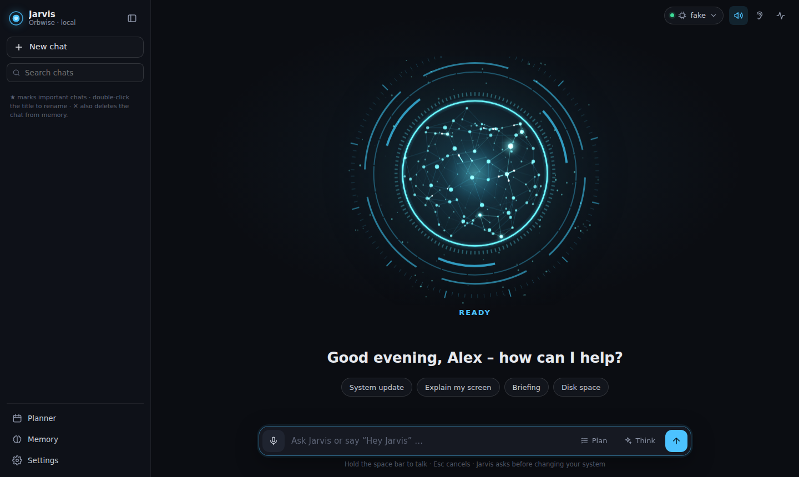

# J.A.R.V.I.S. – a local AI voice assistant for Linux

A Jarvis-style assistant that runs **entirely on your own Linux PC**: an animated HUD web interface, voice input
via wake word ("Hey Jarvis") or push-to-talk, spoken answers, a local LLM (Ollama or llama.cpp), **persistent
memory in plain Markdown files** and real control over your system – updates, packages, files, NAS, apps,
services, network, smart home, documents, notes and calendar.

German and English are supported (`language: de|en`).


<sub>Screenshot in demo mode (`JARVIS_FAKE_LLM=1`, no real model attached).</sub>

```
Browser (localhost:8765)                          Python backend (FastAPI, 127.0.0.1 only)
 ├─ neural-network orb (canvas)         ◄──WS──►  Agent ── tool loop ──► tools (confirm dangerous ones)
 ├─ chat · activity · history · memory             │
 ├─ microphone → 16 kHz PCM             ──WS──►   wake word (openWakeWord) → VAD → Whisper
 └─ playback + level → orb              ◄──────   Piper TTS (sentence by sentence)
                                                   │
                         Ollama / llama-server (LLM + bge-m3)   ~/.local/share/jarvis/memory/
```

> Jarvis is an independent hobby project. It is not affiliated with or endorsed by Marvel or Disney; it does not
> ship the film voice or any other copyrighted material.

## Features

| Area | What Jarvis can do |
|---|---|
| **Voice** | "Hey Jarvis" wake word, microphone button or **hold the space bar** (push-to-talk). Answers are spoken sentence by sentence while the model is still writing; interrupt at any time. |
| **System** | Full system update (Arch: `pacman -Syu` + AUR via yay/paru, Debian/Ubuntu: `apt`), list/search/install/remove packages, system info, shutdown/reboot/suspend/lock |
| **System & network** | Top processes and killing them, systemd services (status, start/stop/restart, logs), IP/gateway/DNS/Wi-Fi, ping, open ports, port checks, disk usage and clean-up |
| **Files** | Find files by name (plocate/fd) or content (ripgrep), list folders, read/write text files, open files and URLs – also on a mounted **NAS** |
| **Apps & web** | Start installed applications, open websites (with your own shortcuts), web search (DuckDuckGo or your own SearXNG), read web pages |
| **Shell** | Any bash command – read-only ones run directly, changing ones only after confirmation, destructive ones never |
| **Everyday** | Weather (Open-Meteo), reminders and timers, morning briefing |
| **Home Assistant** | Find devices by name/room/type, read sensors, switch/dim lights, heating, covers, scenes – locks, alarms and gates only after confirmation |
| **Paperless-ngx** | Search documents, **ask questions about their content**, open them as PDF (read-only) |
| **Obsidian** | Search, read and ask questions about notes in your vault, create/append/update notes, open them in Obsidian |
| **Trilium** | Search and read notes, create notes in the inbox, append to notes |
| **Calendar** | iCloud or any CalDAV server: list events, find free time, create/change/delete events |
| **Memory** | Remembers everything permanently (see below), `remember` / `recall` / `forget`, **chat history** |

## Requirements

- Linux: **Arch-based** (Arch, Manjaro, EndeavourOS, CachyOS) or **Debian/Ubuntu-based** (Debian 12+, Ubuntu 22.04+, Mint)
- A GPU helps a lot: NVIDIA (CUDA) or AMD (ROCm/Vulkan) with ≥ 8 GB VRAM; CPU-only works with small models
- A desktop session (KDE, GNOME, …) for opening files and apps; a Chromium-based browser or Firefox

## Installation

```bash
# Arch-based
sudo pacman -S --needed git
# Debian/Ubuntu-based
sudo apt install git

git clone https://github.com/ressjo/AIAgentLocal.git ~/jarvis
~/jarvis/scripts/install.sh --lang en      # --lang de for German
```

The installer asks three questions – **language**, **graphics card** (NVIDIA / AMD / none, the detected one is
pre-selected) and the **language model** from a list of presets that shows what fits your video memory
(✔ fits · ~ partly in RAM · ✘ too big) with a recommendation. On AMD cards that ROCm doesn't officially support
(RX 6600/6650/6700, RX 7600) it offers to set the needed `HSA_OVERRIDE_GFX_VERSION` for Ollama.

Options: `--model qwen3:8b` (skip the model question), `--gpu auto|cuda|rocm|vulkan|cpu`, `--lang de|en`,
`--yes` (no questions, use the detected/recommended defaults), `--no-autostart`.

> Please install with **git**, not as a ZIP – then updates are a single command (`jarvis update`).
> If you start `install.sh` from a ZIP folder it offers to move to `~/jarvis`.

The installer

1. installs the system packages (Ollama with the right GPU backend, `uv`, `fd`, `ripgrep`, `plocate`, `xdg-utils`, …),
2. sets up the Python environment (`uv sync --extra voice`),
3. pulls the chosen model (recommendation: ≥ 22 GB → `qwen3:30b`, ≥ 12 GB → `qwen3:14b`, ≥ 6 GB → `qwen3:8b`, otherwise `qwen3:4b`) together with `bge-m3` (embeddings) – if a download fails you can pick another model,
4. downloads a Piper voice (English: *Alan*, German: *Thorsten*), the wake word model and Whisper,
5. creates `~/.config/jarvis/config.yaml`, a **JARVIS** entry in the application menu and an autostart entry.

Then:

```bash
jarvis doctor        # checks Ollama, models, voice, wake word, tools, integrations, NAS
jarvis serve --open  # starts the server and opens http://localhost:8765
```

Or click **JARVIS** in the application menu – it opens the UI in its own app window.

### Updating

```bash
jarvis update
```

pulls the latest version (`git pull`), updates the Python dependencies and restarts a running Jarvis server –
then just reload the browser page. `jarvis version` shows what is installed. Your **configuration**
(`~/.config/jarvis/`), **voices** and **memory** (`~/.local/share/jarvis/`) live outside the project folder and
are never touched by updates.

## Using Jarvis

- **Start:** click **START SYSTEM** once (browsers only allow audio/microphone after a click).
- **WAKE** on → say "Hey Jarvis, …". The microphone is only streamed to your own local server.
- **Hold the microphone button / space bar** → speak → release. Tap once to listen until silence.
- **SOUND** toggles speech output, **STOP** (or `Esc`) cancels the current task,
  **THINK** lets the model reason before answering (see [Thinking mode](#thinking-mode)).
- Side panel: **ACTIVITY** (live tool output), **HISTORY** (chats), **MEMORY** (reminders, facts, journal),
  **VOICE** (voices and the Jarvis effect).

Examples:

- "Hey Jarvis, run a system update." → confirmation dialog → live output in the activity panel
- "Install htop and fastfetch." · "How much disk space is left?" · "What's eating my CPU?"
- "Find the newest PDF with *invoice* in its name on the NAS and open it."
- "Restart the Docker service." · "Is my NAS reachable?" · "Show me the last errors of sshd."
- "Turn the living room lights to 40 percent." · "Set the bathroom heating to 22 degrees."
- "When can I cancel my phone contract?" (Paperless) · "What's in my note about Docker?" (Trilium)
- "Remind me in 20 minutes to check the oven." · "Good morning, Jarvis."
- "Remember that my server is at 192.168.1.10." · "What did we do last Tuesday?"

## Memory – without context-window problems

Everything is stored as readable files in `~/.local/share/jarvis/memory/`:

| File | Content |
|---|---|
| `journal/2026-09-27.md` | Complete log of the day – every question, answer and tool call |
| `summaries/2026-09-27.md` | Daily summary, generated automatically (day change or 15 min idle) |
| `facts.md` | Permanent facts ("The NAS is mounted at /mnt/nas") – editable by hand |
| `chats/<id>.json` | One chat: messages, running summary, title, star (`chats/active` = current chat) |
| `index.sqlite` | Search index (full text + embeddings) – just a cache, rebuild with `jarvis reindex` |

**How the context stays small:** every prompt has a budget derived from the model's real context window (minus
room for the answer). It is filled with the system prompt, facts, the **most relevant memories** (hybrid search:
BM25 full text + bge-m3 embeddings, slight preference for recent entries), the running summary and the latest
messages. When a chat gets long, the oldest messages are folded into the running summary by the LLM – they stay
complete in the journal and index and are retrieved again when relevant. Long tool results are trimmed instead of
overflowing the model. The **CONTEXT** tile shows how full the prompt is.

### Chat history

The **HISTORY** tab lists all chats (starred first, then newest) with search across titles and content.
**NEW** starts a new chat; the old one is kept. Click a chat to open and continue it – Jarvis still remembers
everything from the other chats.

- **★** marks important chats. Nothing is deleted automatically.
- **Double-click the title** to rename it (otherwise it is taken from the first question).
- **✕** deletes a chat **completely**: from the list, the journal and the search index; affected daily summaries
  are rebuilt from the rest. Learned facts are kept (delete them in the MEMORY tab or say "forget …").

## Models & profiles

**Adding models after installation:** click the **LLM pill** at the top → **+ ADD MODEL** and pick one of the
presets (with the same fit marks and download progress), or run

```bash
jarvis model add              # interactive list of presets for your GPU
jarvis model add qwen3:14b    # or any model from ollama.com/library
jarvis model add bonsai       # Bonsai 2 27B incl. its llama.cpp server (see below)
jarvis model remove qwen3-14b # remove it from the list (optionally also delete the files)
```

Jarvis can know several language models and switch between them – click the **LLM pill** at the top or run
`jarvis model <name>` (`jarvis model` lists all profiles). The choice is remembered.

- `backend: ollama` – models from Ollama (Qwen 3 recommended for tool use)
- `backend: openai` – any OpenAI-compatible server: **llama-server** from llama.cpp, LM Studio, vLLM, …
- With `server:` Jarvis starts the model server itself when the profile is activated, waits until it is ready and
  stops it again when switching back or quitting (log: `~/.local/state/jarvis-llm.log`). The real context size
  is read from the server.
- `unload_ollama: true` evicts Ollama models from VRAM first, `embed_on_cpu: true` runs the memory embeddings on
  the CPU – useful with 8 GB of VRAM.

**Bonsai 2 27B** (27B-class model in ~7 GB, runs on its own llama.cpp server from the PrismML fork) is set up
automatically: pick it in the installer or run `jarvis model add bonsai`. Jarvis clones
[Bonsai-demo](https://github.com/PrismML-Eng/Bonsai-demo) to `~/bonsai` (or `$JARVIS_BONSAI_DIR`), runs its
`setup.sh` (llama.cpp binaries for CUDA/ROCm + model download) and creates an activated profile with settings for
your GPU – context size by VRAM, compressed KV cache and CPU embeddings on 8 GB cards, the ROCm override for
RX 6600/6700/7600 – and a random `api_key`. On NVIDIA cards without a system CUDA toolkit the prebuilt
llama-server lacks `libcudart`/`libcublas`; Jarvis then downloads NVIDIA's runtime packages from PyPI into
`~/bonsai/cuda-libs` (no root, matched to your driver) and sets `LD_LIBRARY_PATH` in the profile. Running it again
updates the checkout and repairs an existing setup (the `api_key` is kept); `jarvis doctor` shows missing libraries. In the web UI Bonsai is listed
under **+ ADD MODEL** with a pointer to the terminal command, because the setup is interactive.

The same profile written by hand, e.g. **Bonsai 2 27B on an RX 6650 XT (8 GB, ROCm)**:

```yaml
llm:
  active: bonsai
  profiles:
    qwen:
      label: Qwen 3 8B
      model: qwen3:8b
    bonsai:
      label: Bonsai 27B
      backend: openai
      base_url: http://127.0.0.1:8080/v1
      model: bonsai
      api_key: "a-long-random-password"
      embed_on_cpu: true
      unload_ollama: true
      server:
        command: ~/bonsai/scripts/start_llama_server.sh -np 1 --api-key a-long-random-password
        env:
          HSA_OVERRIDE_GFX_VERSION: "10.3.0"   # RX 6600/6650/6700 (gfx103x) → report as supported gfx1030
          BONSAI_CTX: "16384"                 # context window (fall back to 8192 if VRAM runs out)
          BONSAI_KV4: "1"                     # compressed KV cache
          BONSAI_MMPROJ_CPU: "1"              # keep the vision module in RAM (Jarvis doesn't need it)
        startup_timeout: 240
```

The `api_key` keeps websites in your browser from talking to the llama-server.

**Small context windows** (e.g. 8k): Jarvis then sends only the core tools plus the tool groups that match the
request (e.g. Home Assistant tools only when you talk about lights or heating). You can also switch tools or whole
groups off: `tools: {disabled: [sysadmin, paperless]}`.

### Thinking mode

By default the model answers directly (`think: false`) – fast. The **THINK** button turns reasoning on per
request: the orb zooms in and shows the thoughts live, then zooms out when the answer starts; the reasoning can be
expanded under the answer and is never read aloud. It costs time (often 10–60 s per step on smaller GPUs). For
llama-server, **don't** pass `--reasoning-budget 0`, which disables reasoning server-side.

## Voice & Jarvis effect

In the **VOICE** tab you can install, preview and select Piper voices with one click – English (Alan, Northern
English male, Ryan, Joe, Jenny, Amy) or German (Thorsten, Pavoque, Karlsson, Kerstin, Ramona). They are stored
in `~/.local/share/jarvis/voices/`; drop your own Piper voices (`.onnx` + `.onnx.json`) there and they appear too.

The **Jarvis effect** (on/off + strength) adds a slightly deeper, sonorous tone, a light room reverb, a subtle
chorus and a "digital" shimmer.

Speech recognition uses faster-whisper: on NVIDIA set `voice.stt_device: cuda` and `stt_compute_type: float16`;
on AMD it runs on the CPU (`small`/`int8` takes about 1–2 s per sentence).

## Integrations

All integrations are optional – their tools are only offered to the model once URL and token are set.
`jarvis doctor` checks each one. HTTPS with a self-signed certificate: add `verify_ssl: false` (or the path to
your CA file). Home-network services are always contacted directly, never through a system proxy.

### Home Assistant

1. Home Assistant → your profile → **Security** → **Long-lived access tokens** → create token.
2. Config:
   ```yaml
   homeassistant:
     url: http://homeassistant.local:8123
     token: "your-token"          # or $JARVIS_HA_TOKEN
   ```

Tools: `ha_find` (by name, room or type, with state), `ha_state`, `ha_control` (on/off/toggle, brightness,
colour, temperature, open/close/position for covers, scenes/scripts/buttons, lock/unlock, set values).
Locks, alarm panels and garage doors/gates always require confirmation.

### Paperless-ngx

1. Paperless → your profile (top right) → **API auth token**.
2. Config:
   ```yaml
   paperless:
     url: http://nas.local:8000
     token: "your-token"          # or $JARVIS_PAPERLESS_TOKEN
   ```

Search (full text incl. OCR, filter by correspondent/tag/type/date), **ask questions about a document** (short
documents are read completely, long ones only the most relevant passages), read, and open as PDF (cached in
`~/.cache/jarvis/paperless/`). Read-only – nothing is changed in Paperless.

### Obsidian notes

No plugin and no running Obsidian needed – Jarvis works directly on the Markdown files of your vault:

```yaml
obsidian:
  vault: ~/Obsidian/Notes
  inbox: Inbox               # folder for new notes
```

Search (titles, content, tags), read (long notes in sections), **ask questions about a note** (only the most
relevant passages go to the model), create notes in the inbox, append (e.g. shopping list, log), open a note in
the Obsidian app. Replacing a note's content requires confirmation; frontmatter is preserved and paths outside
the vault are refused.

### Trilium notes

1. Trilium → **Options → ETAPI → create new ETAPI token**.
2. Config: `trilium: {url: http://localhost:8080, token: "…"}` (or `$JARVIS_TRILIUM_TOKEN`).

Search, read, create notes (Markdown is converted), append; overwriting a note requires confirmation.

### Calendar (iCloud / CalDAV)

1. iCloud: create an **app-specific password** at [appleid.apple.com](https://appleid.apple.com) → *Sign-In and Security*.
2. Config:
   ```yaml
   calendar:
     url: https://caldav.icloud.com   # or your Nextcloud/Radicale/… CalDAV URL
     username: you@icloud.com
     password: "xxxx-xxxx-xxxx-xxxx"  # or $JARVIS_CALENDAR_PASSWORD
     calendars: []                    # which calendars to read (empty = all)
     default_calendar: ""             # where new events go
   ```

List events, find free time and create events directly; changing and deleting events requires confirmation.
Today's events are part of the morning briefing.

### Websites, weather, reminders

```yaml
websites:
  nas: http://192.168.1.10:5000            # "open the NAS"
  shop: https://example.com/search?q={q}   # {q} = search term
weather:
  location: "Berlin"
```

Reminders and timers are announced by voice, with a banner and chime in the UI and a desktop notification (even
when the UI is closed); missed reminders are reported at the next start.

## Telemetry

The HUD bar above the orb shows (every 2 s, with a sparkline): **TOK/S** (generation speed), **CONTEXT** (prompt
usage vs. budget, with a breakdown in the tooltip), **GPU** load and temperature, **VRAM**, **RAM**/CPU and
**POWER** draw. NVIDIA is read via `nvidia-smi`, AMD directly from the `amdgpu` driver.

## Security

Jarvis can run commands on your system, so:

- **Confirmation required:** everything that changes something (installs, updates, `rm`, writing files, service
  control, killing processes, unknown programs, command substitution `$(…)`) shows a dialog with the exact
  command. Confirm by click, `Enter`/`Esc` or voice ("yes"/"no").
- **Read-only commands** (`ls`, `df`, `systemctl status`, `grep`, …) run directly.
- **Blocklist:** `rm -rf /`, formatting or overwriting disks, fork bombs, `chmod -R … /` and similar are never run –
  not even after confirmation.
- **Local only:** the server listens on `127.0.0.1` and checks the `Host` header and `Origin` – other websites
  cannot send commands.
- **Root privileges** (`privilege_cmd: jarvis`, default): after your confirmation a **password field** appears
  in the dashboard. It works through `sudo -A` with a small helper that uses a one-time token for exactly that
  command; the password goes straight to sudo and is never stored, logged or shown to the model. Alternatives:
  `pkexec` (desktop polkit dialog) or `sudo` with a NOPASSWD rule.
- **Shutdown, reboot, suspend, lock** go through systemd/logind and need no password for the active session.

See [SECURITY.md](SECURITY.md) for details and how to report vulnerabilities.

## AMD GPUs

- Check with `ollama ps` during a request – it should say `100% GPU`.
- Cards that ROCm doesn't officially support (e.g. RX 6600/6700, RX 7600) usually work with an override:
  ```bash
  sudo systemctl edit ollama
  # [Service]
  # Environment="HSA_OVERRIDE_GFX_VERSION=10.3.0"   # RDNA2 (RX 6000)
  # Environment="HSA_OVERRIDE_GFX_VERSION=11.0.0"   # RDNA3 (RX 7000)
  sudo systemctl restart ollama
  ```
- If ROCm doesn't work at all: `./scripts/install.sh --gpu vulkan` (Arch).

## Configuration

All options with explanations: [`jarvis/config.example.yaml`](jarvis/config.example.yaml)
(active file: `~/.config/jarvis/config.yaml`). The most important ones:

| Option | Meaning |
|---|---|
| `language` | `de` or `en` – assistant, speech recognition, default voice, UI and CLI |
| `llm.model` | Ollama model, e.g. `qwen3:14b`, `qwen3:8b` |
| `llm.profiles`, `llm.active` | Several models, see [Models & profiles](#models--profiles) |
| `memory.context_budget_tokens` | Optional cap for the prompt size (default: automatic from the context window) |
| `voice.stt_model` | Whisper size: `base`, `small`, `medium`, `large-v3` |
| `voice.wakeword_threshold` | Wake word sensitivity (lower = more sensitive) |
| `tools.nas_paths` | Mounted NAS folders |
| `tools.privilege_cmd` | `jarvis` (password field, default), `pkexec` or `sudo` (NOPASSWD) |
| `tools.package_manager` | `auto`, `pacman` or `apt` |
| `tools.max_steps` | Max. tool rounds per request (default 25), then Jarvis summarises and offers to continue |
| `tools.disabled` | Tools or groups to switch off, e.g. `[sysadmin, open_ports]` |
| `user_name`, `persona_extra` | How Jarvis addresses you and extra personality instructions |

## Commands

```bash
jarvis serve [--open] [-v]    # start the server
jarvis doctor                 # check the installation
jarvis model [name]           # list or switch model profiles
jarvis model add [ollama-tag] # download another model (interactive presets without a tag)
jarvis model remove <name>    # remove a downloaded model from the list
jarvis update                 # update (git pull, dependencies, restart)
jarvis version                # show the installed version
jarvis reindex                # rebuild the search index from the Markdown files
jarvis summarize [YYYY-MM-DD] # create daily summaries
jarvis init-config            # create the example configuration
```

## Troubleshooting

| Problem | Solution |
|---|---|
| `jarvis: command not found` | Open a new terminal (PATH was extended) or run `~/jarvis/scripts/install.sh` again |
| The orb stays "OFFLINE" | Is `jarvis serve` running? Log: `~/.local/state/jarvis.log` |
| "Ollama not reachable" | `sudo systemctl enable --now ollama` |
| No Piper speech | `jarvis doctor` → voice missing? The browser speaks as a fallback |
| Microphone doesn't work | Open `http://localhost:8765` (not the IP), check the browser's microphone permission |
| Wake word triggers too often/rarely | Adjust `voice.wakeword_threshold` (0.3–0.7) |
| No password field appears | The dashboard must be open; `jarvis doctor` checks the askpass helper |
| A file/app doesn't open | `jarvis doctor` → "Desktop": graphical session and default apps; set one with `xdg-mime default org.kde.kate.desktop text/plain`, or say "open X with Kate" |
| Integration "unreachable" | The message names the address, reason and a tip (certificate → `verify_ssl: false`, wrong port, http vs https, …); check with `jarvis doctor` |
| Web search: SearXNG `403 Forbidden` | Public SearXNG instances block the JSON API – leave `tools.searxng_url` empty (DuckDuckGo) or use your own instance |
| File search misses new files | `sudo updatedb` |
| Answers get cut off / "context too small" | Increase the model's context window; watch the CONTEXT tile |

## Development

```bash
uv sync --extra voice --extra dev
uv run pytest -q                                   # all tests run offline, no GPU/Ollama needed
uv run ruff check jarvis tests
JARVIS_FAKE_LLM=1 uv run jarvis serve --open       # UI demo without a model ("/tool <name> <json>" calls tools)
```

See [CONTRIBUTING.md](CONTRIBUTING.md) for the project layout and how to write a new tool.

## License

[MIT](LICENSE)
